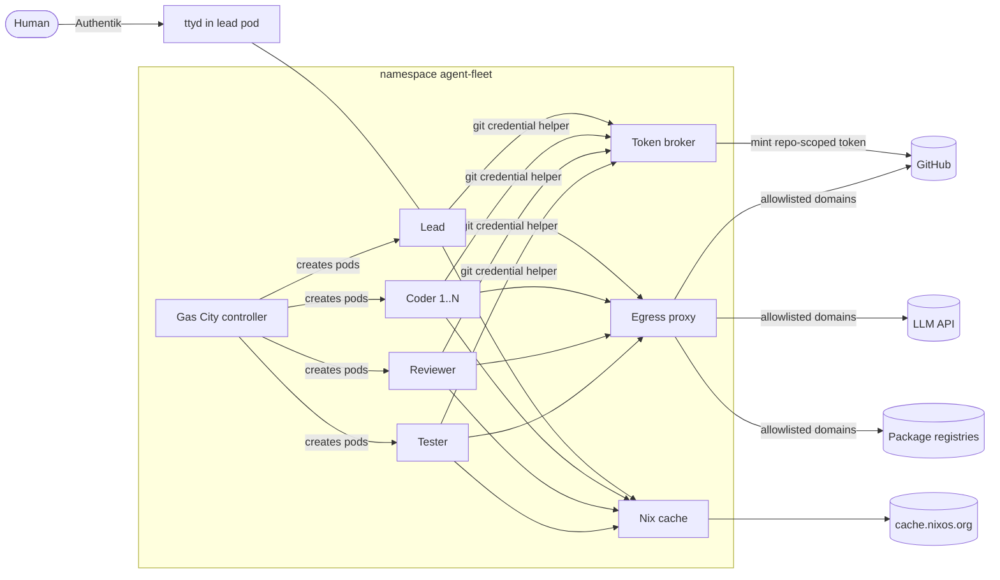

# Agent fleet on Kubernetes: design doc

Sep 29, 2026 · @Luuk · revision 2

## Summary

We will run a self-hosted fleet of coding agents on the home k3s cluster, orchestrated by Gas City, where a lead agent plans work, delegates it to coder, reviewer and tester agents, and a human approves the result as a pull request. Each agent runs in its own sandboxed pod with its own short-lived, single-repo credentials, and reaches the internet only through an allowlisting egress proxy. The target repository is chosen per task at runtime; onboarding a new project never requires a deployment change. Everything in the stack is open source, and the agent harness (Claude Code, OpenCode, others) is a per-role config value, not an architectural choice.

### Goals

- Agents that work together: a lead agent decomposes a task, worker agents execute in parallel, a separate reviewer agent critiques the work before any human sees it.
- Kubernetes native: all agents run as pods, deployed declaratively through the existing Flux setup in `home-server`.
- Least privilege by default: every agent gets only the tokens, network egress and filesystem access its role needs, scoped to the one repository of its task.
- Runtime project selection: the human names the repository when giving the lead a task. No config or deployment change per project.
- Harness-agnostic: switching an agent from Claude Code to OpenCode is a config change.
- Generic tooling through Nix: agents get any language toolchain via `nix shell` or the repo's own flake, without per-language images.
- Containers inside the sandbox: agents can build and run containers with rootless Podman, so test suites that need containers (testcontainers, compose) work.
- A browser-based interface to talk to the lead agent and watch agents work.
- Humans stay the final gate: agents open pull requests, humans merge.

### Non-goals (for now)

- Private repositories. Agents work on public GitHub repositories only.
- A Slack, Mattermost or Matrix integration. Planned for later; the design leaves a clean seam for it.
- Agents deploying to production or merging their own work.
- Multi-cluster or multi-tenant operation, or a reusable Helm chart for other clusters.
- Building our own agent harness or LLM gateway.

## Architecture



Every agent pod runs as a Kata Containers VM, has no Kubernetes API access, and can reach only the egress proxy, the Nix cache, the token broker and DNS.

A task flows through the system in this order:

1. A human gives the lead agent a task and a target repository (`owner/repo`) through the web terminal.
2. The lead plans the work and splits it into tasks on the Gas City work queue. Each task carries the target repository.
3. Gas City launches coder pods, each picking up one task and working on its own `agent/<task-id>` branch.
4. The reviewer reviews each coder branch against its task. A failed review goes back to a coder as a new task, up to the review round limit.
5. The lead merges the approved coder branches into its integration branch `agent/<task-id>/integration` and resolves conflicts.
6. The tester runs the test suite on the integration branch. A failure goes back to the lead.
7. The lead opens one pull request from the integration branch. A human reviews and merges it.

## Components

### Orchestration: Gas City

[Gas City](https://github.com/gastownhall/gascity) (MIT, Go) is the orchestration layer. It is an SDK extracted from Gas Town that provides a declarative `city.toml`, runtime providers (tmux, subprocess, exec, ACP, Kubernetes), Beads-backed durable work queues, formulas that describe how a job gets done, and a controller loop that reconciles desired state.

We use it for: defining agent roles, routing work to them, tracking tasks so they survive crashes, and running the review step. We run it with its Kubernetes runtime provider so each agent session becomes a pod.

Gas City is young and the design leans on it. If phase 1 shows its Kubernetes runtime is not good enough, the fallback is plain Kubernetes Jobs created by a small controller with the Beads queue, keeping everything else in this design unchanged.

### Runtime and isolation

- Agents run as pods created by Gas City's Kubernetes runtime.
- Runtime: [Kata Containers](https://katacontainers.io/). Each agent pod is a lightweight VM with its own guest kernel. The nodes are bare metal, so KVM is available.
- Kata over gVisor because agents run rootless Podman, Nix builds and arbitrary test suites. These need a real Linux kernel (user namespaces, overlayfs, cgroups), which gVisor only partly emulates. Kata also gives a hardware virtualization boundary, which is stronger than gVisor's. The cost is memory overhead and slower startup per pod, measured in phase 1.
- Hypervisor: QEMU or Cloud Hypervisor, chosen in phase 1. Not Firecracker, since it needs the devmapper snapshotter.
- Preferred orchestration of the sandbox: [agent-sandbox](https://github.com/kubernetes-sigs/agent-sandbox) (Kubernetes SIG Apps), which provides a `Sandbox` CRD with a Kata `RuntimeClass`, plus warm pools to hide VM startup time.
- Fallback if Gas City cannot create `Sandbox` resources: plain pods with the Kata `RuntimeClass`, a per-role NetworkPolicy and per-role credentials.
- Kata is installed on the nodes through their NixOS configuration and registered as a runtime with k3s's containerd, with `privileged_without_host_devices = true` so privileged settings never pass host devices into a VM. This is node configuration, not something Flux deploys.
- gVisor stays a fallback if Kata proves unworkable, at the cost of Podman support.
- sandbox-operator is explicitly not used; it overlaps with both of the above.

### Agent images and tooling (Nix)

- One image per harness, containing only the harness, git, a git credential helper for the token broker, Nix, and rootless Podman. No language toolchains.
- Images are built with Nix (`dockerTools` or nix2container) from the `agent-fleet` flake. `flake.lock` pins every version, including the harness CLIs.
- Agents get tooling on demand: the repo's own `flake.nix` or `shell.nix` if present, otherwise ad hoc `nix shell nixpkgs#<tool>`.
- `/nix` is a writable volume seeded from the image. The rest of the root filesystem is read-only; the workspace is a separate writable volume.
- Nix's own build sandbox stays enabled; it works inside the Kata guest kernel.
- An in-cluster pull-through binary cache (ncps or Attic, chosen in phase 1) sits in front of cache.nixos.org, so short-lived pods do not download the same toolchains repeatedly. Packages not in the binary cache that need source downloads from other hosts fail by default; we widen this only if it proves too strict.
- Rootless Podman runs as the agent user inside the VM, with its storage on a writable volume. It needs `/etc/subuid` and `/etc/subgid` in the image and setuid `newuidmap`/`newgidmap`, so agent pods allow privilege escalation inside the VM. The VM boundary, not the container's security context, is what isolates the agent. The exact security context is settled in phase 1.
- Containers started by Podman share the agent pod's network namespace, so they are subject to the same NetworkPolicy and egress proxy. Image pulls go through the proxy to allowlisted registries. An in-cluster registry mirror, like the Nix cache, can come later if pulls become slow.
- Nix provides toolchains, not project dependencies. `npm install`, `cargo fetch` and similar still need their package registries through the egress proxy.

### Agent roles

| Role | Does | Can write to | GitHub App | Token permissions |
| --- | --- | --- | --- | --- |
| Lead | Talks to the human, plans, splits work, assigns tasks, integrates coder branches, opens the pull request | Task queue, its integration branch | `agent-writer` | contents write, pull requests write |
| Coder (1..N) | Implements one task on its own branch | Its own `agent/*` branch | `agent-writer` | contents write |
| Reviewer | Reviews coder branches against the task and plan, requests changes or approves | Review comments | `agent-reader` | contents read, pull requests write (comments) |
| Tester | Runs the test suite on the integration branch and reports results | Test reports | `agent-reader` | contents read |

The reviewer is deliberately separate from the coders: its own pod, a fresh context, a different prompt and read-only repository access. A coder never reviews its own work. The reviewer's permissions technically allow approving a pull request, but an agent approval never satisfies the merge rule (see Git permissions).

### Harnesses

- Default harness: Claude Code, for the lead and coders.
- Supported alternatives: OpenCode, Codex CLI, Gemini CLI, via Gas City's harness support.
- The harness is set per role in config. A cheaper model, or a local model on the cluster's existing Ollama instance via OpenCode, is a valid choice for the tester.
- Role prompts live in plain files in the `agent-fleet` repo, not in harness-specific files, so they can be reused across harnesses. Harness-specific files (`CLAUDE.md`, `AGENTS.md`) are generated from them or kept minimal.

### Token broker

A small in-cluster service and the only component holding the GitHub App private keys. Agents never see an App key or a long-lived token.

- Both GitHub Apps are installed on "All repositories" of the personal account once. This also covers private repositories, so the broker enforces the public-only rule.
- An agent requests a token through its git credential helper, authenticating with a projected ServiceAccount token whose audience is the broker. That ServiceAccount has no Kubernetes RBAC.
- The broker identifies the calling pod, reads its role and target repository from pod labels and annotations set by Gas City (so the agent cannot claim a different repository), and checks at request time that:
  - the repository is public;
  - the standard agent ruleset is present on it.
- If both hold, it mints a GitHub App installation token restricted to that one repository and to the role's permissions from the roles table. Tokens expire after one hour; the credential helper refreshes them.
- If the ruleset is missing, the broker refuses and the lead tells the human that the repository needs the agent ruleset.
- Prefer an existing open-source token broker if one fits; otherwise this is a small Go service in the `agent-fleet` repo.

### Egress proxy

- An allowlisting HTTP(S) forward proxy (smokescreen, Squid or Envoy, chosen in phase 1) filtering `CONNECT` by hostname. No TLS interception.
- One allowlist per role, enforced by giving each role its own listener and letting NetworkPolicy route each role only to its listener.
- Baseline allowlist: GitHub (`github.com`, `api.github.com`, `codeload.github.com`, `objects.githubusercontent.com`), the role's LLM provider API, package registries for roles that install dependencies, and container registries (Docker Hub, GHCR, Quay) for roles that pull images.
- The proxy's access log is the harness-independent record of every outbound connection and goes to Loki.

## Security model

Security lives in the infrastructure, not in the harness. The harness's own permission system is a second line of defense, never the only one. This keeps the setup safe when we add or swap harnesses.

Threat to design against: prompt injection through repository content, issues, pull request comments or fetched web pages that makes an agent misuse its credentials, exfiltrate data or attack other services on the cluster or home network. Public repositories are exactly where untrusted content comes from, so this threat is the expected case, not an edge case.

- **Isolation:** one pod per agent session, each a Kata VM. The agent runs as a non-root user; the root filesystem is read-only, with writable `/nix`, Podman storage and workspace volumes only. Nested containers run rootless under that user.
- **Cluster access:** `automountServiceAccountToken: false` on every agent pod, per-role ServiceAccounts with no RBAC, only the Gas City controller can create pods, and only in its own namespace.
- **Network:** default-deny ingress and egress on the namespace. Agent pods may reach only DNS, their egress proxy listener, the Nix cache and the token broker. Explicitly no access to other namespaces (Vaultwarden, Authentik, databases, Garage), node IPs, or home LAN ranges. The Ollama service is allowed only for roles configured to use it. Allowing a broad domain such as GitHub is itself an exfiltration path, which is why token scope matters as much as egress.
- **Credentials:** GitHub tokens come only from the token broker: one repository, role permissions, one hour. LLM API keys are one per role, stored as SealedSecrets and mounted only into that role's pods, so usage and cost are tracked per role.
- **Git permissions:** every target repository carries the standard agent ruleset, kept as JSON in the `agent-fleet` repo and applied once per repository with `scripts/apply-ruleset.sh owner/repo` or the GitHub UI:
  - branch creation and updates are restricted everywhere except `agent/**`, with a bypass only for the repository owner;
  - the default branch requires a pull request with code owner approval, and `CODEOWNERS` names only the human;
  - no GitHub App is on any bypass list.
  The broker checks for the ruleset but never applies it, so it does not need the Administration permission.
- **Approvals:** actions outside a role's normal scope go to the lead, and the lead escalates to a human rather than approving them itself.
- **Limits:** a runaway agent is a cost and security problem, so limits are part of the design:
  - maximum concurrent coders, default 3;
  - `activeDeadlineSeconds` on every agent pod;
  - maximum reviewer to coder rounds per task, default 3, after which the lead escalates to the human;
  - spend limits per role API key at the provider (usage-based billing);
  - a kill switch: one documented command that scales the controller to zero and deletes all agent pods.
- **Audit:** see Observability. Retain logs long enough to investigate an incident (90 days).
- **Billing and terms:** automated workloads use API billing, not a personal subscription. Check each provider's terms for automated use.

## Observability

A Loki, Alloy and Grafana stack in the `observability` namespace, modelled on [gewis/k8s-infra](https://github.com/gewis/k8s-infra) (`apps/observability`), with these differences:

- single tenant;
- Grafana login through Authentik OIDC, restricted to an Authentik group;
- pinned chart versions so Renovate manages upgrades;
- Loki in single-binary mode on a dedicated Longhorn StorageClass, 90-day retention.

This stack is useful for the whole cluster and is built first, independently of the agent work.

Audit logging has two layers:

- **Infrastructure, always on and harness-independent:** egress proxy access logs, token broker issuance logs (pod, role, repository, permissions), pod lifecycle, and GitHub activity by the agent Apps.
- **Harness, where supported:** prompts, tool calls and commands, for example through Claude Code's OpenTelemetry or hooks. Coverage differs per harness, and that is accepted.

Agent pods carry `agent-fleet/role` and `agent-fleet/task-id` labels, which Alloy turns into Loki labels.

## Web UI

The interface starts as a browser terminal into the lead agent and grows into a dashboard later. Gas City's roadmap mentions factory-floor visualization, but it does not exist yet, so we do not depend on it.

**Phase 1: web terminal.** Gas City requires tmux, so the lead runs in a tmux session. Expose it through [ttyd](https://github.com/tsl0922/ttyd) in the lead's pod, behind a Traefik IngressRoute with the existing Authentik `proxy-auth` middleware, restricted to an Authentik group. Worker agents get no ingress; debugging a worker uses `kubectl exec` into its tmux session.

**Phase 2: dashboard.** A small web app that reads Gas City's work queue and events and shows: active tasks and their state, which agent holds each task, recent agent activity, and links to the pull requests and Grafana. Read-only first; actions (cancel a task, restart an agent) come after.

**Later: chat.** An open-source chat bridge (Mattermost, Matrix/Element or Zulip) that forwards messages to the lead. Gas City already ships bridges for other messengers, so this should follow the same pattern. Out of scope for now.

## Repositories and deliverables

There is no dedicated Helm chart. Deployment follows the existing `home-server` pattern: plain manifests plus upstream charts through Flux `HelmRelease`.

**`home-server`** holds how the fleet is deployed:

```
home-server/
  apps/
    observability/        # Loki, Alloy, Grafana
    agent-fleet/
      namespace.yaml
      gascity.yaml        # upstream chart via HelmRelease, or manifests
      network-policies.yaml
      egress-proxy/
      nix-cache/
      token-broker/
      sealed-secrets/     # per-role LLM keys, GitHub App keys (broker only)
      ingressroute.yaml   # ttyd, Authentik proxy-auth
  infra/
    agent-sandbox/        # if chosen in phase 1
```

**`agent-fleet`** (new, public) holds what gets built, published to GHCR by CI and bumped here by Renovate:

```
agent-fleet/
  flake.nix, flake.lock    # images and broker, all versions pinned
  images/                  # Nix image definitions per harness
  broker/                  # token broker, unless an existing project fits
  city/
    city.toml              # agents, roles, harness per role, limits
    formulas/              # plan, implement, review, integrate, test
  roles/                   # harness-neutral role prompts
    lead.md
    coder.md
    reviewer.md
    tester.md
  github/
    ruleset.json           # the standard agent ruleset
  scripts/
    apply-ruleset.sh
    verify-phase-N.sh
  dashboard/               # phase 5
  docs/
    DESIGN.md              # this document
    RUNBOOK.md             # install, onboard a repo, rotate keys, kill switch, incident response
    findings.md            # phase 1 answers
```

How the Gas City config and role prompts reach the cluster (baked into an image, or a Flux `OCIRepository`) is decided in phase 1.

Deliverables:

- The observability stack in `home-server`.
- Manifests in `home-server` that deploy the fleet into one namespace.
- Nix-built agent images per harness, pinned, non-root.
- The token broker, the egress proxy config and the Nix cache.
- Role prompts and formulas for lead, coder, reviewer and tester.
- The standard ruleset and the script to apply it.
- A runbook covering install, onboarding a repository, key rotation, the kill switch and what to do if an agent misbehaves.
- The phase 5 dashboard.

## Implementation phases

Build in six phases. Each phase ends with a working, demonstrable system, and the next phase starts only when its acceptance criteria pass.

0. **Observability.** Loki, Alloy and Grafana in `home-server`, Grafana behind Authentik.
   - Done when: logs from every namespace are queryable in Grafana and only the Authentik group can log in.
1. **Spike: verify the unknowns.** Answer every item in Open questions with a short written finding and, where possible, a minimal proof of concept.
   - Done when: each open question has an answer in `docs/findings.md`, and Kata with rootless Podman is confirmed (or the gVisor fallback chosen), and the hypervisor, egress proxy and Nix cache are chosen.
2. **One agent in one pod.** Gas City with its Kubernetes runtime starts a single Claude Code agent in a Kata pod, with the egress proxy, Nix cache, token broker and default-deny NetworkPolicy in place. A human reaches it through ttyd behind Authentik.
   - Done when: the agent, given a public test repository at runtime, can clone it, get a toolchain with `nix shell`, run a container with rootless Podman, make a change on an `agent/*` branch and push it; and it cannot reach a non-allowlisted domain, another namespace, a node IP or the home LAN; cannot push to the default branch; cannot get a token for a private repository, for a repository without the ruleset, or for a different repository than its task's.
3. **Lead plus coders.** The lead takes a task and a repository from the web terminal, splits it, and assigns subtasks to two coder agents in separate pods. Work is tracked in the Gas City queue.
   - Done when: a task that touches two files is completed by two coders in parallel, the lead integrates both branches and opens one pull request, and a second repository works without any deployment change.
4. **Reviewer, tester and limits.** Add the reviewer and tester roles to the flow, the review round limit, pod deadlines and the kill switch.
   - Done when: a deliberately buggy change is caught by the reviewer or tester and sent back; a task that keeps failing review stops after the round limit and escalates; the kill switch stops everything; every agent action appears in Loki with role and task id.
5. **Harness swap and dashboard.** Run the tester on OpenCode instead of Claude Code with no change to anything but config. Build the read-only dashboard.
   - Done when: switching the tester's harness is a one-line config change; the dashboard shows live task state for all agents.

## Decided

- Cluster: the home k3s cluster, deployed through Flux from `home-server`. Nodes are NixOS.
- Egress control: an allowlisting forward proxy, not a CNI change.
- Git host: GitHub, personal account, public repositories only.
- Target repository: chosen per task at runtime; onboarding a repository is only applying the ruleset.
- GitHub identities: two Apps, `agent-writer` and `agent-reader`, with repository-scoped tokens from the token broker.
- Tooling: Nix in every agent image, no per-language images.
- Isolation: Kata Containers on the bare-metal nodes, with rootless Podman in every agent image. gVisor only as fallback.
- Access: one Authentik group for ttyd and Grafana.
- Observability: Loki, Alloy and Grafana, modelled on gewis/k8s-infra.
- Billing: usage-based API keys, one per role.
- Packaging: no dedicated Helm chart; a separate `agent-fleet` repo for built artifacts.

## Open questions

These are unverified assumptions or undecided choices. Phase 1 answers them before anything else is built.

- [ ] Can Gas City's Kubernetes runtime provider create agent-sandbox `Sandbox` resources, or only plain pods? If only pods, can we set `runtimeClassName`, ServiceAccount, labels, annotations (role, task id, target repository) and volumes on them?
- [ ] How is the harness chosen per agent in `city.toml`, and which harnesses are supported today?
- [ ] Where does Gas City keep state when running on Kubernetes (Beads on Dolt, the Kubernetes-backed providers), and what needs a PersistentVolume?
- [ ] Does the lead's tmux session run inside the lead's pod, or in the Gas City controller? This decides where ttyd runs.
- [ ] Kata on NixOS and k3s: which hypervisor, what memory overhead and startup time per pod, and how fast are `nix shell`, a typical build and I/O on the workspace volume?
- [ ] Rootless Podman inside Kata: the minimal security context that works, the storage driver, and whether each harness's own sandbox works alongside it.
- [ ] Which egress proxy (smokescreen, Squid, Envoy) and which Nix cache (ncps, Attic)?
- [ ] Is there an existing open-source GitHub App token broker that does per-pod, per-repository token minting, or do we write one? Can it check the ruleset with read-only permissions?
- [ ] How do the Gas City config and role prompts get into the cluster?
- [ ] Which LLM provider and model per role, and which provider-side spend limits are available?
- [ ] Is there a Gas City formula or pack for a plan, implement, review, integrate, test flow that we can start from instead of writing our own? The gascity-packs repo is the place to check.

## Instructions for Claude Code

You are building this system. Work phase by phase and treat each phase's acceptance criteria as the definition of done.

- Start with phase 0, then phase 1. Do not write production code for the fleet until the open questions are answered in `docs/findings.md`. Read the actual Gas City, agent-sandbox and proxy docs and source; do not rely on this document's assumptions about them.
- If a finding contradicts this design, stop and propose a change to the design before building around it.
- Before each phase, write a short plan with the files you will create and how you will verify the acceptance criteria. Wait for approval.
- Follow the conventions of `home-server`: Flux `HelmRelease` for upstream charts, SealedSecrets for secrets, Traefik IngressRoutes with the Authentik `proxy-auth` middleware, Longhorn for storage.
- Pin every version: container images, Helm charts, flake inputs, Go modules, harness CLIs.
- Never commit real tokens or keys. The human creates real secrets and commits them only as SealedSecrets; document how.
- Test against a local cluster (kind or k3d) first. Every phase needs a repeatable way to verify it, preferably a script in `scripts/verify-phase-N.sh`.
- Prefer upstream features over custom code. If Gas City, agent-sandbox, GitHub or Kubernetes already does something, use it. Custom code is for glue, the token broker if needed, and the dashboard.
- Keep role prompts harness-neutral in `roles/`. Anything harness-specific goes in the image or a generated file.
- Update `docs/RUNBOOK.md` whenever you add something an operator needs to install, configure or rotate.
